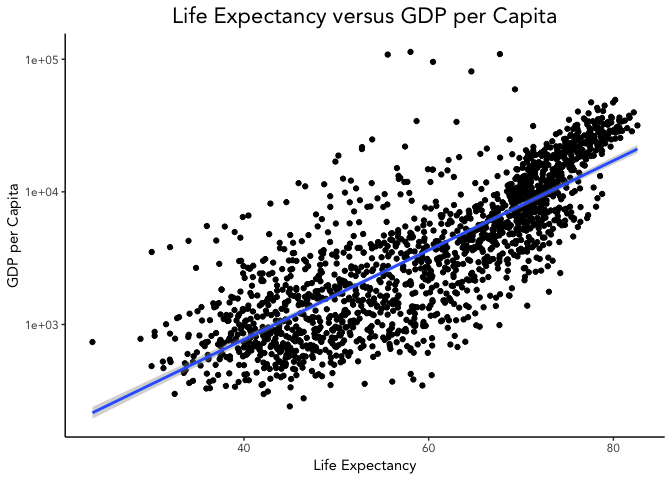
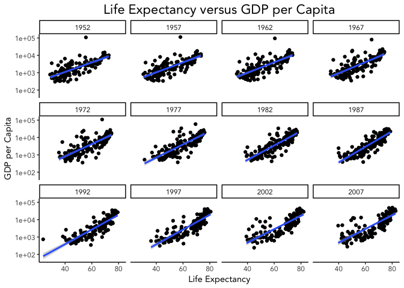
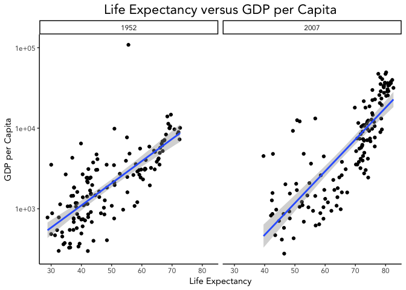
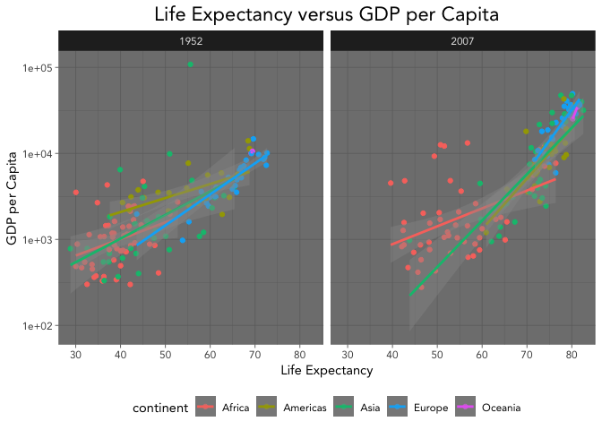
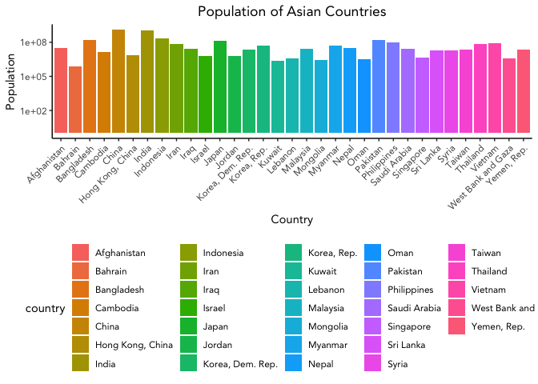
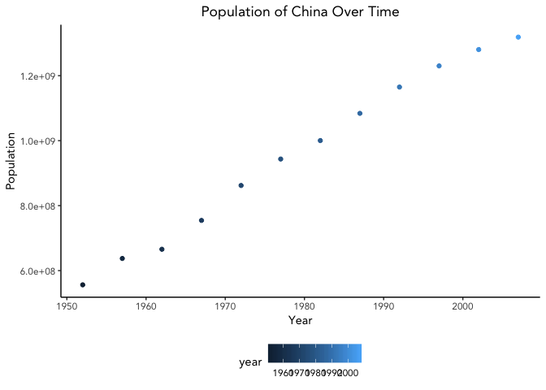
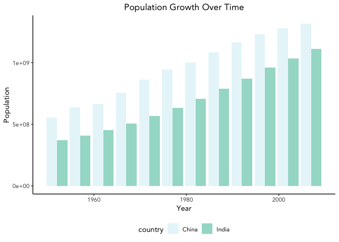

```r
library(tidyverse)
library(skimr)
library("RColorBrewer")
```


```r
#install.packages("gapminder")
```


```r
library("gapminder")
```


```r
gapminder <- 
  gapminder::gapminder
```

1. Explore the data using the various function you have learned. Is it tidy, are there any NA's, what are its dimensions, what are the column names, etc.


```r
gapminder
```

```
## # A tibble: 1,704 x 6
##    country     continent  year lifeExp      pop gdpPercap
##    <fct>       <fct>     <int>   <dbl>    <int>     <dbl>
##  1 Afghanistan Asia       1952    28.8  8425333      779.
##  2 Afghanistan Asia       1957    30.3  9240934      821.
##  3 Afghanistan Asia       1962    32.0 10267083      853.
##  4 Afghanistan Asia       1967    34.0 11537966      836.
##  5 Afghanistan Asia       1972    36.1 13079460      740.
##  6 Afghanistan Asia       1977    38.4 14880372      786.
##  7 Afghanistan Asia       1982    39.9 12881816      978.
##  8 Afghanistan Asia       1987    40.8 13867957      852.
##  9 Afghanistan Asia       1992    41.7 16317921      649.
## 10 Afghanistan Asia       1997    41.8 22227415      635.
## # … with 1,694 more rows
```


```r
gapminder %>% 
  summarize(number_nas= sum(is.na(gapminder)))
```

```
## # A tibble: 1 x 1
##   number_nas
##        <int>
## 1          0
```
 #The data is tidy. There are no NA's. It is 6 by 1704. The columns are country, continent, year, life expectancy, pop, and gdp per capita. 
 
2. We are interested in the relationship between per capita GDP and life expectancy; i.e. does having more money help you live longer on average. Make a quick plot below to visualize this relationship.


```r
gapminder %>% 
  ggplot(aes(x=lifeExp, y= gdpPercap))+
  geom_point()+
  scale_y_log10()+
  theme_classic(base_family = "Avenir")+
  labs(title = "Life Expectancy versus GDP per Capita",
       x = "Life Expectancy",
       y = "GDP per Capita")+
  theme(plot.title = element_text(size = rel(1.5)))+
  theme(plot.title = element_text(hjust = 0.5))+
  geom_smooth(method = "lm")+
  theme(legend.position = "bottom")
```

<!-- -->
 having more money correlates with living longer on average.
 
 3. There is extreme disparity in per capita GDP. Rescale the x axis to make this easier to interpret. How would you characterize the relationship?
Whoops, done above

4. This should look pretty dense to you with significant overplotting. Try using a faceting approach to break this relationship down by year.

```r
gapminder %>% 
  ggplot(aes(x=lifeExp, y= gdpPercap))+
  geom_jitter()+
  scale_y_log10()+
  theme_classic(base_family = "Avenir")+
  labs(title = "Life Expectancy versus GDP per Capita",
       x = "Life Expectancy",
       y = "GDP per Capita")+
  theme(plot.title = element_text(size = rel(1.5)))+
  theme(plot.title = element_text(hjust = 0.5))+
  geom_smooth(method = "lm")+
  theme(legend.position = "bottom")+
  facet_wrap(~year)
```

<!-- -->

5. Simplify the comparison by comparing only 1952 and 2007. Can you come to any conclusions?


```r
gapminder %>% 
  filter(year== 1952 | 
         year== 2007) %>% 
  ggplot(aes(x=lifeExp, y= gdpPercap))+
  geom_jitter()+
  scale_y_log10()+
  theme_classic(base_family = "Avenir")+
  labs(title = "Life Expectancy versus GDP per Capita",
       x = "Life Expectancy",
       y = "GDP per Capita")+
  theme(plot.title = element_text(size = rel(1.5)))+
  theme(plot.title = element_text(hjust = 0.5))+
  geom_smooth(method = "lm")+
  theme(legend.position = "bottom")+
  facet_wrap(~year)
```

<!-- -->
 The GDP per capita had a narrower range in 1952, so having more money had slightly less impact on your life expectancy in 1952 than it did in 2007.
 
 6. Let's stick with the 1952 and 2007 comparison but make some aesthetic adjustments. First try to color by continent and adjust the size of the points by population. Add `+ scale_size(range = c(0.1, 10), guide = "none")` as a layer to clean things up a bit.


```r
gapminder %>% 
  filter(year== 1952 | 
         year== 2007) %>% 
  ggplot(aes(x=lifeExp, y= gdpPercap, color = continent))+
  geom_point()+
  scale_y_log10()+
  theme_light(base_family = "Avenir")+
  labs(title = "Life Expectancy versus GDP per Capita",
       x = "Life Expectancy",
       y = "GDP per Capita")+
  theme(plot.title = element_text(size = rel(1.5)))+
  theme(plot.title = element_text(hjust = 0.5))+
  geom_smooth(method = "lm")+
  theme(legend.position = "bottom")+
  facet_wrap(~year)+
  scale_size(range = c(0.1, 10), guide = "none")
```

```
## Warning in qt((1 - level)/2, df): NaNs produced

## Warning in qt((1 - level)/2, df): NaNs produced
```

<!-- -->

7. Although we did not introduce them in lab, ggplot has a number of built-in themes that make things easier. I like the light theme for these data, but you can see lots of options. Apply one of these to your plot above.

Again, oops. already done. 


```r
gapminder %>% 
  filter(year== 1952 | 
         year== 2007) %>% 
  ggplot(aes(x=lifeExp, y= gdpPercap, color = continent))+
  geom_point()+
  scale_y_log10()+
  theme_dark(base_family = "Avenir")+
  labs(title = "Life Expectancy versus GDP per Capita",
       x = "Life Expectancy",
       y = "GDP per Capita")+
  theme(plot.title = element_text(size = rel(1.5)))+
  theme(plot.title = element_text(hjust = 0.5))+
  geom_smooth(method = "lm")+
  theme(legend.position = "bottom")+
  facet_wrap(~year)+
  scale_size(range = c(0.1, 10), guide = "none")
```

```
## Warning in qt((1 - level)/2, df): NaNs produced

## Warning in qt((1 - level)/2, df): NaNs produced
```

<!-- -->

8. What is the population for all countries on the Asian continent in 2007? Show this as a barplot.


```r
gapminder %>% 
  filter(continent== "Asia") %>% 
  filter(year== 2007) %>% 
  ggplot(aes(x=country, y=pop, fill= country))+
  geom_bar(stat = "identity")+
  scale_y_log10()+
  theme_classic(base_family = "Avenir")+
  theme(axis.text.x = element_text(angle = 45, hjust = 1))+
  theme(legend.position = "bottom")+
  theme(plot.title = element_text(hjust = 0.5))+
  labs(title = "Population of Asian Countries",
       x = "Country",
       y = "Population")
```

<!-- -->

9. You should see that China's population is the largest with India a close second. Let's focus on China only. Make a plot that shows how population has changed over the years.


```r
gapminder %>% 
  filter(country== "China") %>% 
  ggplot(aes(x=year, y= pop, color= year))+
  geom_point()+
  #scale_y_log10()+
  theme_classic(base_family = "Avenir")+
  theme(axis.text.x = element_text(angle = 0, hjust = 0.5))+
  theme(legend.position = "bottom")+
  theme(plot.title = element_text(hjust = 0.5))+
  labs(title = "Population of China Over Time",
       x = "Year",
       y = "Population")
```

<!-- -->


10. Let's compare China and India. Make a barplot that shows population growth by year using `position=dodge`. Apply a custom color theme using RColorBrewer.

```r
library("RColorBrewer")
```


```r
display.brewer.all()
```

<!-- -->


```r
gapminder %>% 
  filter(country== "China" | country== "India") %>% 
  ggplot(aes(x=year, y= pop, fill= country))+
  geom_bar(stat="identity", alpha=0.9, na.rm=T, position="dodge")+  
  #scale_y_log10()+
  theme_classic(base_family = "Avenir")+
  theme(axis.text.x = element_text(angle = 0, hjust = 0.5))+
  theme(legend.position = "bottom")+
  theme(plot.title = element_text(hjust = 0.5))+
  labs(title = "Population Growth Over Time",
       x = "Year",
       y = "Population")+
  scale_fill_brewer(palette = "BuGn")
```

<!-- -->

